# SVG Icon Agent

SVG Icon Agent is a lightweight text-to-SVG project for Computer Graphics Project 3.
It turns short English icon prompts into editable SVG icons through a fully
LLM-backed multi-agent pipeline: goal management, planning, multi-candidate SVG
drafting, semantic and SVG-quality critique, consensus selection, SVG
optimization, validation, failure taxonomy, repair routing, refinement, memory
curation, and gallery export. A Goal Manager Agent first turns the prompt,
optional user goal, and retrieved historical memories into explicit generation
criteria. A Prompt Rewriter Agent then optimizes the input description, and an
SVG Optimizer Agent improves the selected draft from team feedback before
validation. The Web UI renders the same dependency structure as a directed
runtime-status graph, so each stage can be tracked as waiting, active, done,
skipped, or error. Local code is limited to prompt loading, historical memory
retrieval, machine-checkable SVG safety checks, rendering, and reporting tools.

## Quick start

```bash
python3 -m venv .venv
.venv/bin/python -m pip install --upgrade pip
.venv/bin/python -m pip install -r requirements.txt
.venv/bin/python -m unittest discover -s tests
```

Use OpenRouter with `openai/gpt-oss-120b:free` by copying `.env.example` to
`.env` or exporting the variables in your shell:

```bash
export OPENROUTER_API_KEY="your-key"
export OPENROUTER_MODEL="openai/gpt-oss-120b:free"
.venv/bin/python main.py \
  --prompt prompts/examples.json \
  --out outputs \
  --backend openrouter \
  --request-timeout 30 \
  --max-retries 1 \
  --empty-response-retries 3 \
  --max-tokens 4096 \
  --reasoning-effort none \
  --workflow collaborative \
  --candidate-count 3 \
  --goal "make it suitable for a mobile toolbar" \
  --memory-top-k 3 \
  --optimizer-feedback "simplify the silhouette and increase negative space"
```

Manual input is also supported:

```bash
.venv/bin/python main.py --text "a minimal rocket launch icon with a dynamic flame" --out outputs/manual
.venv/bin/python main.py --interactive --out outputs/manual
.venv/bin/python main.py --prompt prompts/examples.json --list-cases
.venv/bin/python main.py --prompt prompts/examples.json --case-id object-rocket,object-coffee-cup --out outputs/selected
```

Start the Web UI for interactive runs and live Agent status visualization:

```bash
export OPENROUTER_API_KEY="your-key"
.venv/bin/python web.py --host 127.0.0.1 --port 7860 --out outputs/web
```

Then open `http://127.0.0.1:7860`. Web runs are written to timestamped
directories under `outputs/web/`.

OpenRouter free models can be slow or queued. The pipeline makes model calls for
goal management, prompt rewriting, planning, candidate SVG drafting, LLM critique,
consensus selection, SVG optimization, validation, failure taxonomy, repair
routing, memory curation, and LLM refinement when repairs are needed. The default
workflow retrieves similar local run memories and shows the generated goal,
retrieved memories, rewritten prompt, and live Agent workflow in the Web UI.
After a Web run completes, enter new advice in `Optimizer feedback` and click
`Apply feedback` to run a post-run Optimizer pass on the latest SVG, followed by
the existing Validator/Refiner/export steps.
The Web UI also includes an `SVG Editor` panel for source-level editing of the
generated SVG. It loads the final refined SVG first, falls back to the optimized
baseline or selected SVG, updates a live preview as you type, and saves edits as
separate `edited/` artifacts. Server-side saves run `SvgCheckTool`; error-level
validation issues are rejected, warning-level issues are returned in the Web
payload, and the original selected/baseline/refined outputs are preserved.
The command prints realtime progress for each stage. If a model call fails, the
error is logged; the system does not synthesize a local SVG fallback.

Generated SVG, PNG, JSON metrics, and an HTML gallery are written under `outputs/`.

Useful output files:

- `outputs/baseline/*.svg`: first-pass SVG icons.
- `outputs/candidates/*.svg`: candidate drafts from collaborative mode.
- `outputs/selected/*.svg`: raw Consensus Selector winners before optimization.
- `outputs/refined/*.svg`: LLM-refined SVG icons.
- `outputs/edited/*.svg`: Web UI SVG editor saves that preserve the generated originals.
- `outputs/png/baseline/*.png` and `outputs/png/refined/*.png`: raster previews.
- `outputs/png/edited/*.png`: raster previews for saved SVG editor copies.
- `outputs/gallery.html`: side-by-side visual comparison for the report and slides.
- `outputs/metrics.json`: aggregate validity and score improvements.
- `outputs/generation_goal.json`: structured goals from the Goal Manager Agent.
- `outputs/memory_context.json`: retrieved historical memories used by the run.
- `outputs/memory/memory_index.jsonl`: local reusable memory records.
- `outputs/failure_taxonomy.json`: per-round failure categories and repair goals.
- `outputs/repair_routes.json`: per-round repair routes and Refiner Agent briefs.
- `outputs/refinement_history.json`: per-icon repair logs.
- `outputs/llm_trace.json`: model usage, stage status, errors, and score trace.
- `outputs/llm_raw_responses.jsonl`: sanitized raw OpenRouter responses and error payloads.
- `outputs/web/<run-id>/...`: per-run Web UI artifacts with the same file
  structure plus live-event and post-run optimization traces.

## Agent workflow

The Web UI and report use the following directed Agent dependency graph. Blue
boxes in the PDF report denote LLM-backed Agents, green boxes denote
deterministic tools/export steps, and orange boxes denote the conditional repair
route.

```mermaid
flowchart LR
  memory[Memory Retrieval Tool] --> goal[Goal Manager Agent]
  goal --> rewriter[Prompt Rewriter Agent]
  rewriter --> planner[Planner Agent]
  planner --> generator[Multi-Candidate Generator Agent]
  generator --> semantic[Semantic Critic Agent]
  generator --> quality[SVG Quality Critic Agent]
  semantic --> selector[Consensus Selector Agent]
  quality --> selector
  selector --> optimizer[SVG Optimizer Agent]
  optimizer --> validator[Validator Agent]
  validator -- invalid --> taxonomy[Failure Taxonomy Agent]
  taxonomy --> router[Repair Router Agent]
  router --> refiner[Refiner Agent]
  refiner --> validator
  validator -- valid --> exporter[Exporter Tool]
  exporter --> curator[Memory Curator Agent]
```



During a Web run, each graph node is assigned a runtime state:

- `waiting`: the stage has not run yet.
- `active`: the stage is currently running or is the latest event.
- `done`: the stage completed through the configured LLM provider or local tool.
- `skipped`: the stage is not needed, such as repair agents after a valid baseline.
- `error`: the stage caused or received a failed run state.

## Pipeline

1. MemoryRetrievalTool retrieves similar local historical runs from
   `outputs/memory/memory_index.jsonl`. It is a tool, not an Agent.
2. Goal Manager Agent creates structured generation goals and acceptance criteria.
   This Agent calls the configured LLM provider.
3. Prompt Rewriter Agent rewrites the user prompt into a concise SVG-icon prompt.
   This Agent calls the configured LLM provider.
4. Planner Agent extracts icon intent, palette, category, objects, and constraints.
   This Agent calls the configured LLM provider.
5. Multi-Candidate Generator Agent creates several different SVG drafts.
   This Agent calls the configured LLM provider.
6. Semantic Critic Agent judges prompt alignment and small-icon readability.
   This Agent calls the configured LLM provider.
7. SVG Quality Critic Agent judges editability, safety, and rendering risk using
   local `SvgCheckTool` findings as evidence. This Agent calls the configured LLM provider.
8. Consensus Selector Agent chooses the strongest candidate and writes a repair
   brief for the next Agent. This Agent calls the configured LLM provider.
9. SVG Optimizer Agent rewrites the selected SVG using Critic, Selector,
   `SvgCheckTool`, and optional manual feedback. This Agent calls the configured LLM provider.
10. Validator Agent judges semantic alignment, visual quality, editability, and
   rule compliance. This Agent calls the configured LLM provider and receives
   local `SvgCheckTool` findings as evidence.
11. Failure Taxonomy Agent classifies blocking issues into repairable failure
   types, root causes, evidence, priority, and repair goals.
12. Repair Router Agent chooses a route such as safety rebuild, semantic
   recomposition, simplification, layout rebalance, or minor patch.
13. Refiner Agent repairs validation issues by returning a complete revised SVG
   using the routed repair brief. This Agent calls the configured LLM provider.
14. Memory Curator Agent summarizes successful/failed lessons into the local
   memory index. This Agent calls the configured LLM provider.
15. Local tools render PNG previews, metrics, trace logs, and the gallery.

## Current experiment

The default experiment uses collaborative mode with 3 candidates per prompt over
12 English prompts across UI icons, object icons, and small scene icons. Use
`--workflow single` for a faster ablation baseline. The same pipeline also
accepts selected cases, one manual prompt, or one interactive prompt for live
demos.

The report snapshot in `reports/svg_icon_agent_report.pdf` uses the completed
Web runs in `outputs/web/`: 4 prompts, 12 generated candidates, 4 selected
winners, 3/4 valid optimized baselines, 4/4 valid final refined icons, and an
average validation-score improvement from 91.25 to 97.50.

## Report

The English PDF report is stored at:

- `reports/svg_icon_agent_report.pdf`

Its LaTeX source and bibliography are:

- `reports/svg_icon_agent_report.tex`
- `reports/references.bib`

Rebuild the report with:

```bash
cd reports
latexmk -pdf -interaction=nonstopmode -halt-on-error svg_icon_agent_report.tex
```

## Project positioning

This project avoids training large image models. Its graphics component is editable
SVG generation, while its agent component is a decomposed LLM-provider-backed
goal management, retrieval-augmented prompt conditioning, planning, candidate
generation, critique, selection, validation, failure taxonomy, repair routing,
memory curation, and self-repair loop.
Deterministic local code is only used as a toolchain for syntax/safety checks,
rendering, and report export.

## CLI options

- `--prompt`: run local JSON prompt cases.
- `--case-id`: choose comma-separated cases from `--prompt`.
- `--list-cases`: list available prompt cases and exit.
- `--text`: run one manual prompt.
- `--interactive`: type one prompt interactively.
- `--backend openrouter`: use the OpenRouter LLM pipeline.
- `--model`: OpenRouter model id, default `openai/gpt-oss-120b:free`.
- `--workflow`: `collaborative` by default; use `single` for ablation.
- `--candidate-count`: number of SVG candidates in collaborative mode, default 3.
- `--no-prompt-rewrite`: disable Prompt Rewriter Agent for ablation.
- `--goal`: optional manual generation goal for Goal Manager Agent.
- `--memory-top-k`: number of local historical memories to retrieve, default 3.
- `--no-memory`: disable local historical memory retrieval.
- `--rebuild-memory-index`: rebuild `outputs/memory/memory_index.jsonl` from prior outputs.
- `--optimizer-feedback`: manual improvement advice for the SVG Optimizer Agent.
- `--no-llm-optimizer-feedback`: optimizer uses only manual feedback and
  `SvgCheckTool` context, without Critic/Selector advice.
- `--request-timeout`: per-request OpenRouter timeout in seconds.
- `--max-retries`: retry count for retryable OpenRouter failures.
- `--empty-response-retries`: retry count for empty model messages, default 3.
- `--max-tokens`: optional `max_tokens` override for each LLM Agent request.
- `--reasoning-effort`: OpenRouter reasoning effort, default `none`.
- `--reasoning-max-tokens`: optional reasoning token cap; takes precedence over effort.
- `--llm-stage plan-svg`: the LLM performs both planning and SVG drafting.
- `--max-refine-rounds`: maximum LLM repair rounds after validation.
- `--quiet`: hide realtime progress logs.
