# Project3说明

# 生成式AI实践

**2026春 计算机图形学** **Project 3**

<!-- Page 2 -->

什么是Agent？

|自主性级别 (Autonomy Level)|示例系统 (Example Systems)|解锁的 AGI 级别 (Unlocking AGI Level(s))|引入的示例风险 (Example Risks Introduced)|
|---|---|---|---|
|自主性级别 0：无 AI 人类完成所有工作    |模拟方法（例如，用铅笔在纸上画草图） 非 AI 数字工作流（例如，在文本编辑器中打字； 在绘图程序中画图）|无 AI |不适用（现状风险）|
|自主性级别 1：AI 作为工具 人类完全控制任务，并使用 AI 自动化繁琐的子任 务   |借助搜索引擎寻找信息 借助语法检查程序修改写作 使用机器翻译应用阅读标牌|可能：初级狭义 AI 很可能：胜任狭义 AI |技能退化（例如，过度依赖），对成熟行业的颠覆|
|自主性级别 2：AI 作为顾问 AI 承担实质性角色，但仅在人类调用时   |依赖语言模型总结一组文档 使用代码生成模型加速计算机编程 通过复杂的推荐系统消费大部分娱乐内容|可能：胜任狭义 AI 很可能：专家狭义 AI；初级 AGI |过度信任，激进化，定向操纵|
|自主性级别 3：AI 作为合作者 人类与 AI 平等协作；目标与任务的交互式协调    |通过与下棋 AI 的互动和分析来进行国际象棋棋手 训练 通过与 AI 生成的人格进行社交互动来娱乐|可能：初级 AGI 很可能：专家狭义 AI；胜任 AGI   |拟人化（例如，准社会关系 / 虚拟恋爱），快速的 社会变革|
|自主性级别 4：AI 作为专家 AI 主导互动；人类提供指导和反馈或执行子任务 |使用 AI 系统推进科学发现（例如，蛋白质折叠）|可能：卓越狭义 AI 很可能：专家 AGI   |社会规模的精神倦怠 (ennui)，大规模劳动力流失， 人类例外论（特殊性）的衰落|
|||||
|自主性级别 5：AI 作为智能体 完全自主的 AI   我们在这里|自主的 AI 驱动个人助手|很可能：卓越 AGI；人工超级智能 (ASI) |目标错位 (misalignment)，权力集中|

Morris M R, Sohl-dickstein J, Fiedel N, et al. Levels of AGI for Operationalizing Progress on the Path to AGI[C]. Proceedings of the 41 st International Conference on Machine Learning, Vienna, Austria. PMLR 235, 2024.

<!-- Page 3 -->

什么是Agent？

我们在这里

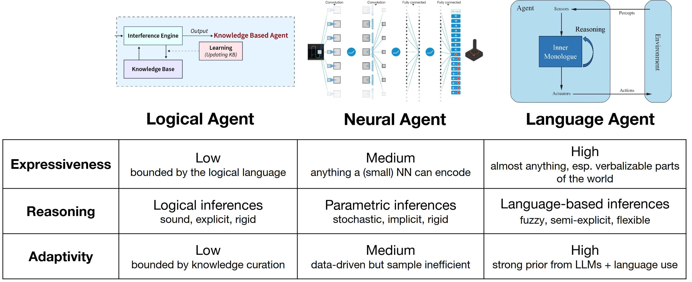

Mnih et al., “Human-level control through deep reinforcement learning.” Nature (2015)

<!-- Page 4 -->

Agent与图形学？

1. 基于NeRF和
1. 意图解析与自动
1. 剧本拆解与分镜

3DGS的自动生成。

化，如提示词优化。

规划。

2. 基于Blender的
2. 精准的2D排版
2. 角色与场景的时

自动化场景搭建。

和生成，如海报生 空一致性控制。

成。

3. 代码驱动的程序
3. 视频素材的理解

化生成。

3. 多Agent协同协

和剪辑。

作，如迭代优化。

<!-- Page 5 -->

## 01 2D生成

5

<!-- Page 6 -->

### 意图解析智能体 ——GenPilot

文生图模型在面对复杂或长提示词容易出现语义不一致、细节丢失等问题； 现有优化方法如微调需要训练模型并且只 适配特定模型，自动提示优化方法（APO）缺乏系统性的误差分析和改进策略，导致可靠性和效果有限；大多测试时增 强只改噪声空间或采样数，不对提示词本身进行修改，可解释性差。

GenPilot：多智能体（Multi-Agent）测试时提示词优化系统，在不训练、不微调模型的前提下，自动优化提示词，让 阶段二：测试时提示优化

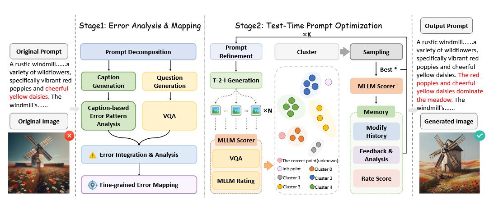

文生图更准、更贴合描述。

阶段一：错误分析 https://github.com/27yw/GenPilot

<!-- Page 7 -->

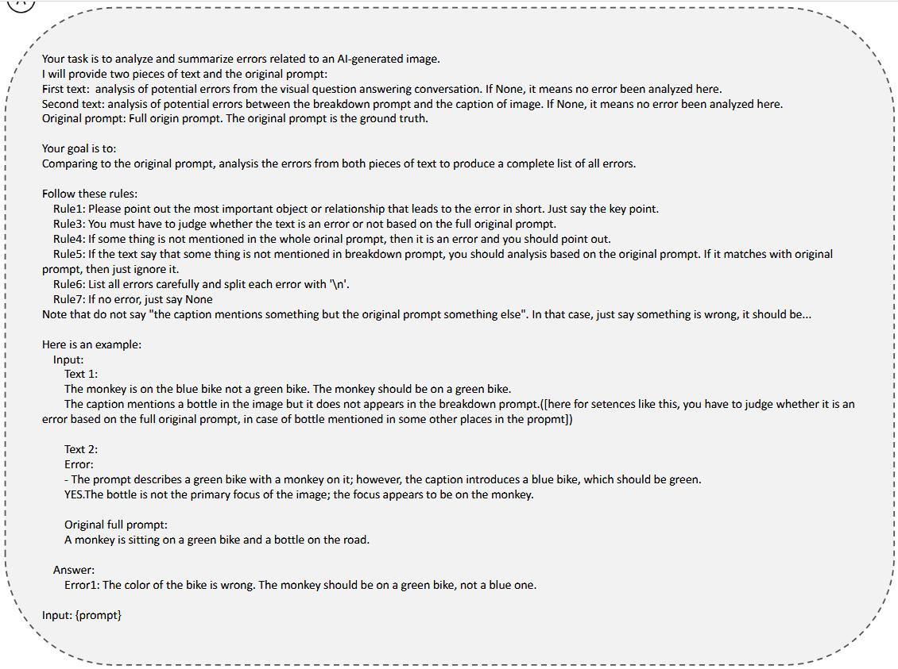

|Genpilot :|Col2|
|---|---|

阶段一：错误分析

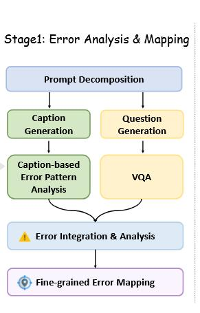

子片段”ϒ=  Ϯ1 Ϯ2 . .. Ϯϩ ，每个 提示分解：将原始提示分解为“句 片段包含对象、关系、背景信息 双路错误检测：

VQA分支：引入了MLLMAgent以

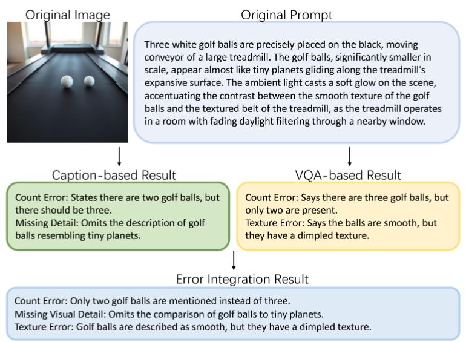

生成全覆盖问题。生成Yes/No问题 （存在性、属性、空间关系），用 MLLM回答 Caption分支： MLLM生成详细描 述用于比较Agent与原始提示对比 错误融合与映射：

错误整合：Agent错误整合整合 两路结果，生成完整错误集 错误映射：将每个错误映射回原 始提示的具体句子片段 https://github.com/27yw/GenPilot

<!-- Page 8 -->

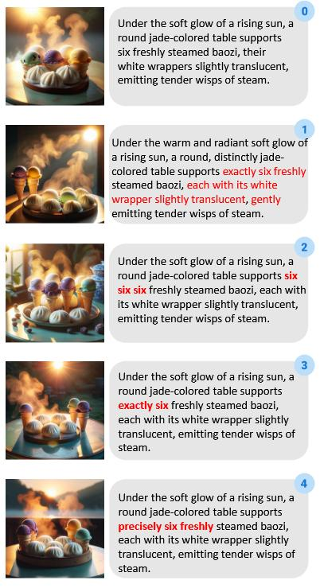

### Genpilot :

提示词改进：

提示词改进Agent：基于元 阶段二：测试时提示优化 数据修改错误映射的句子 ϨϤ，生成多样化的备选改

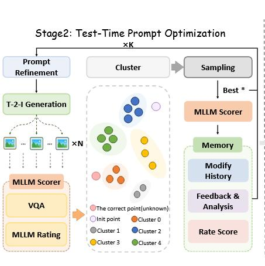

进。

分支-合并Agent ：合并ϨϤ 到原始提示词P中，生成备 选提示词Πβ 将备选提示词输入T2IM中 生成图像。

**MLLM**评分器：

VQA Agent：评估不一致性 评分Agent：打分 聚类：选出最优的提示词集合 记忆模块：存储最优提示、图 像、评分、错误摘要，供下一轮 参考 https://github.com/27yw/GenPilot

<!-- Page 9 -->

### Genpilot :

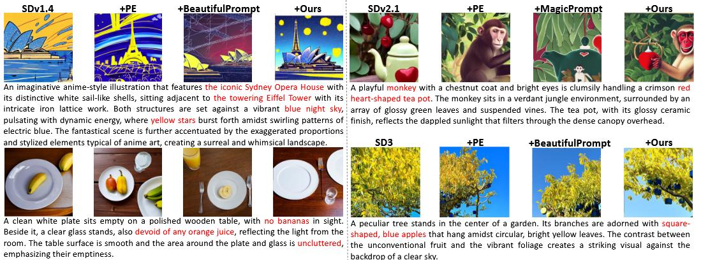

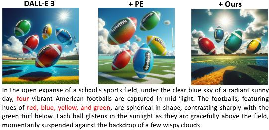

生 成 无 误

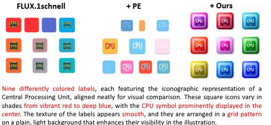

差 图 像 更丰富的细节表示 更好的生成不真实场景

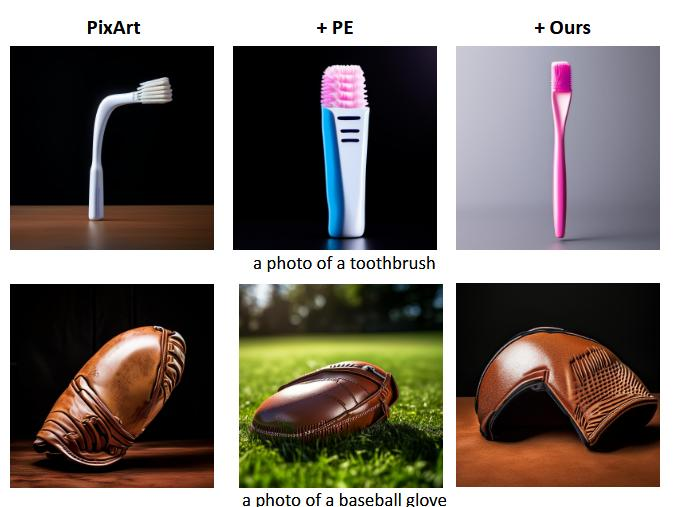

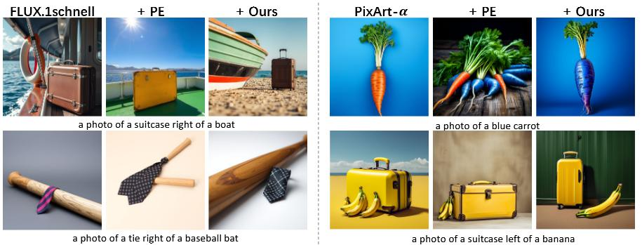

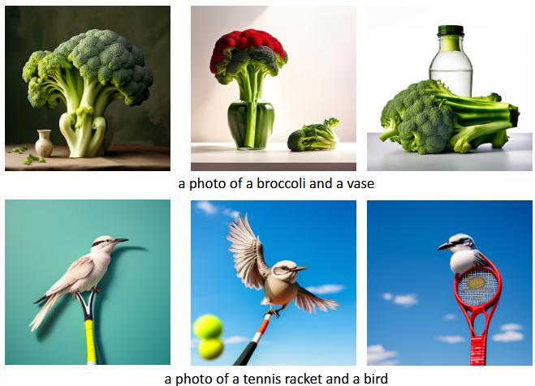

<!-- Page 10 -->

|Col1|2D排版智能体——Paper2Poster Paper2Poster ：将一篇学术论文（平均22.6页，约2万 oken，含22.6张图） 自动转化为单页学术海报（约774|
|---|---|
|**Paper2Poster** ：将一篇学术论文（平均22.6页，约2万 token，含22.6张图） 自动转化为单页学术海报（约774 词，8.7张图），用于学术会议展示。 不重新训练图像模型，而是通过 Parser、Planner和 Painter-Commenter loop等模块完成内容提炼、二维版 式规划、图文协调和可视化渲染。|**Paper2Poster** ：将一篇学术论文（平均22.6页，约2万 oken，含22.6张图） 自动转化为单页学术海报（约774|

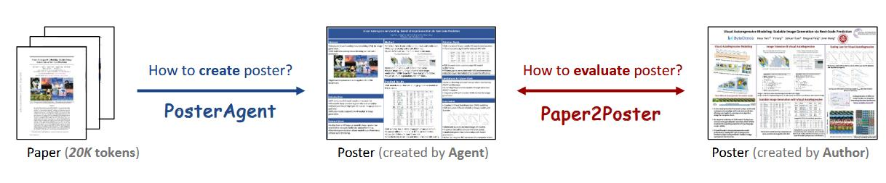

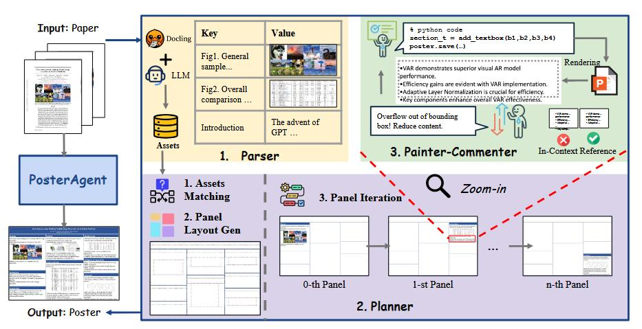

整体架构 Parser：提取论文文本+图表，构建资产库 Planner：图文语义匹配+二叉树布局， 保证阅读顺序与空间平衡 Painter-Commenter循环：生成面板 内容 + 视觉反馈修正 https://github.com/Paper2Poster/Paper2Poster

<!-- Page 11 -->

### 迭代优化智能体——PosterForest

https://github.com/kaist-cvml/poster-forest

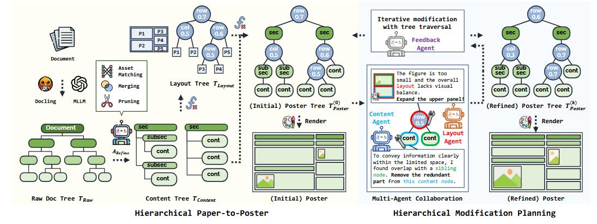

**PosterForest** ：一个无 需训练、基于层级多智能 体协作的学术海报生成框 架，通过显式建模论文的 层级结构（节-小节-段落） 并将其与海报布局树联合 优化，解决现有方法信息 丢失、逻辑断裂、视觉失 衡的问题。

内容Agent和布局 Agent反复协调、相互

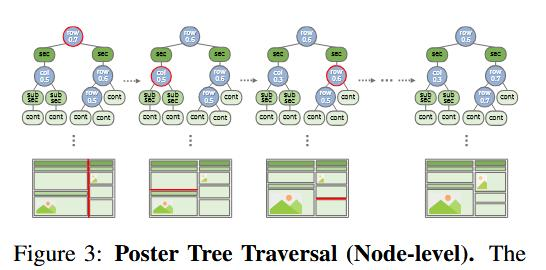

反馈、逐步优化结果。它

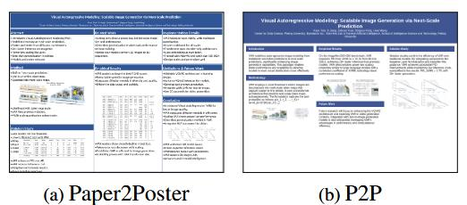

的特色在于“多Agent 协同协作”和“迭代优化” 这两个点，因为它不是一 次性生成，而是通过多轮 规划和修正得到更合理的 2D结果。

<!-- Page 12 -->

### 参考资料

|参考资料|Col2|Col3|Col4|
|---|---|---|---|
|数据集|介绍|链接||
|数据集|介绍|链接||
|DiffusionDB|大规模 text-to-image prompt 数据集，适合做 prompt 优化、 生成行为分析和图文输入研究。|https://poloclub.github.io/diffusiondb/|https://poloclub.github.io/diffusiondb/|
|GenEval|面向 text-to-image alignment 的自动评测 benchmark，适合 验证 prompt 优化后图像是否更符合文本意图。|https://huggingface.co/papers/2310.1 1513|https://huggingface.co/papers/2310.1 1513|
|Paper2Poster Dataset|面向 paper-to-poster 任务的配对数据与评测套件，最贴合精准 2D 排版生成与多 Agent 海报系统评估。| https://github.com/Paper2Poster/Pape r2Poster| https://github.com/Paper2Poster/Pape r2Poster|

1. GenPilot: A Multi-Agent System for Test-Time Prompt Optimization in Image Generation. Findings of EMNLP 2025.

https://aclanthology.org/2025.findings-emnlp.49/

2. PromptSculptor: Multi-Agent Based Text-to-Image Prompt Optimization. EMNLP 2025 System Demonstrations.

https://aclanthology.org/2025.emnlp-demos.59/

3. Paper2Poster: Towards Multimodal Poster Automation from Scientific Papers. NeurIPS 2025 Datasets and Benchmarks Track.

https://openreview.net/forum?id=p0E74lpRBD

4. Paper2Poster: Towards Multimodal Poster Automation from Scientific Papers. arXiv 2025.

https://arxiv.org/abs/2505.21497

5. PosterForest: Hierarchical Multi-Agent Collaboration for Scientific Poster Generation. arXiv 2025.

https://arxiv.org/abs/2508.21720

6. PosterGen: Aesthetic-Aware Paper-to-Poster Generation via Multi-Agent LLMs. arXiv 2025.

https://arxiv.org/abs/2508.17188

<!-- Page 13 -->

## 02 3D生成

13

<!-- Page 14 -->

### CAD生成——CAD-Assistant

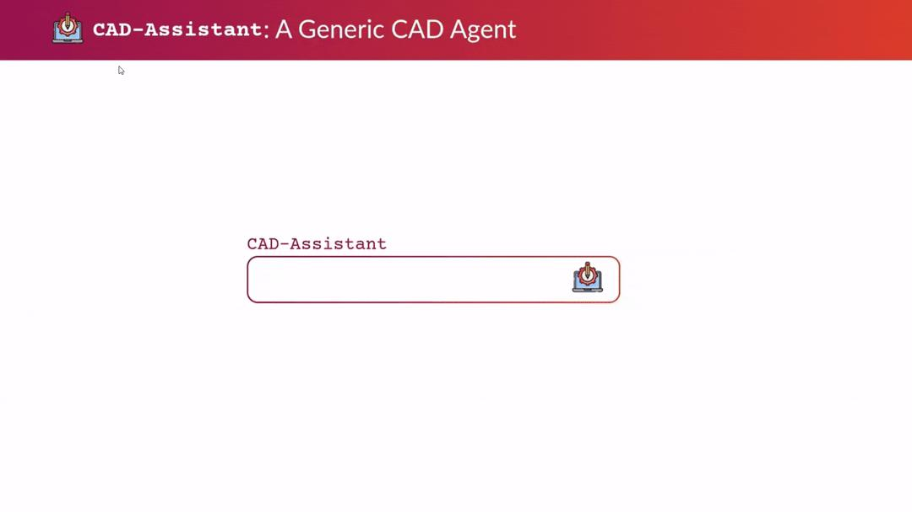

CAD-Assistant：一种工具增强型视觉语言模型（VLLM）框架。通过 工具增强范式构建通用CAD任务求解框架，支持多模态输入和动态设 计适配。

核心思路是通过 VLLM 规划 + CAD 专用工具集 + 实时环境交互，解 决 VLLMs 在几何推理、CAD 语义理解上的短板，实现通用化 CAD 任务求解 全程无需训练，仅通过复用预训练模型与工具链，支持文本、手绘草 图、3D 扫描等多模态输入，覆盖从草图参数化到逆向工程的多样化 CAD 场景。

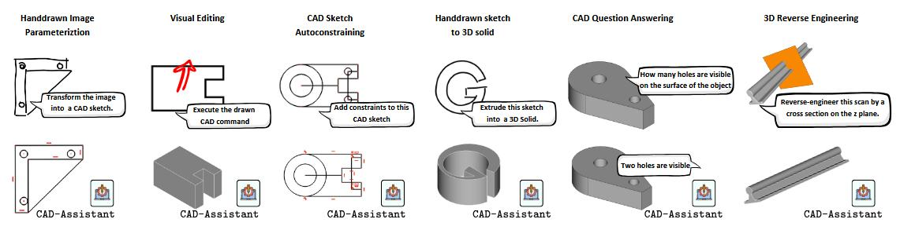

https://cadassistant.github.io

<!-- Page 15 -->

### CAD生成——CAD-Assistant

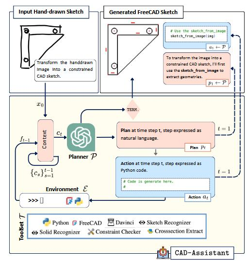

核心组件：

规划器（ Planner ）： GPT-4o（做 VLLM 大脑），分 析用户请求 + 当前 CAD 状态，生成下一步的 Python 代 码 环境（ Environment ）：集成FreeCAD软件的Python API，执行生成的代码 工具集（ Tool Set ）：包括 FreeCAD 接口、草图参数 化、渲染、约束检查、截面生成等 CAD 专用工具 执行流程：

用户输入（文本 / 图像 / 3D扫描 / 手绘命令） Planner 任 生成plan(自然语言) 更 务 新 完 上 成 生成action(Python 代码) 下 文 在环境（FreeCAD） 中执行动作

<!-- Page 16 -->

### CAD生成——CAD-Assistant

执行示例：

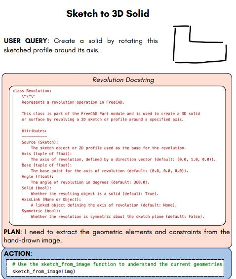

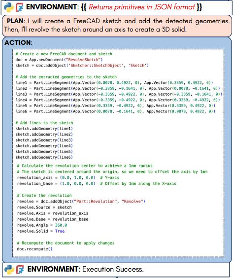

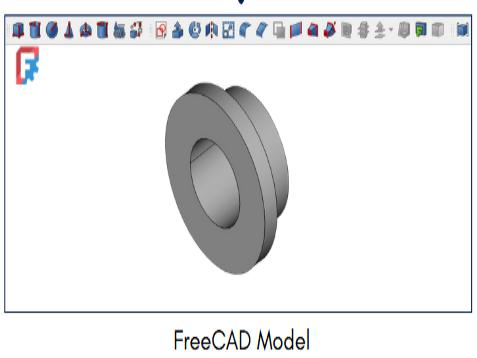

<!-- Page 17 -->

### 3D场景生成——SAGE

https://nvlabs.github.io/sage/ SAGE：基于多智能体的3D场景生成框架，能够根据任意用户文本描述，自动生成可直接部署于机器人仿真器的、物 理稳定且视觉真实的室内场景，并利用这些场景规模化生成训练数据，提升具身智能策略的泛化能力。

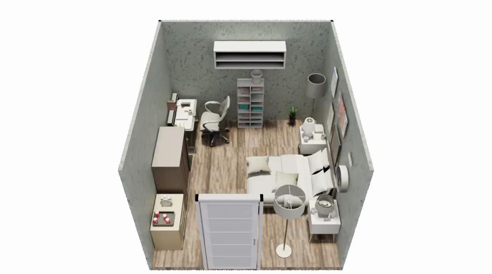

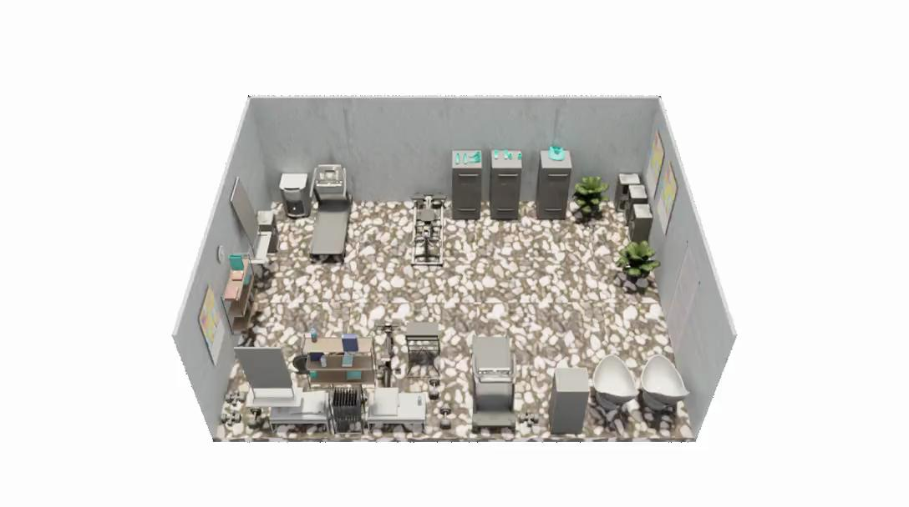

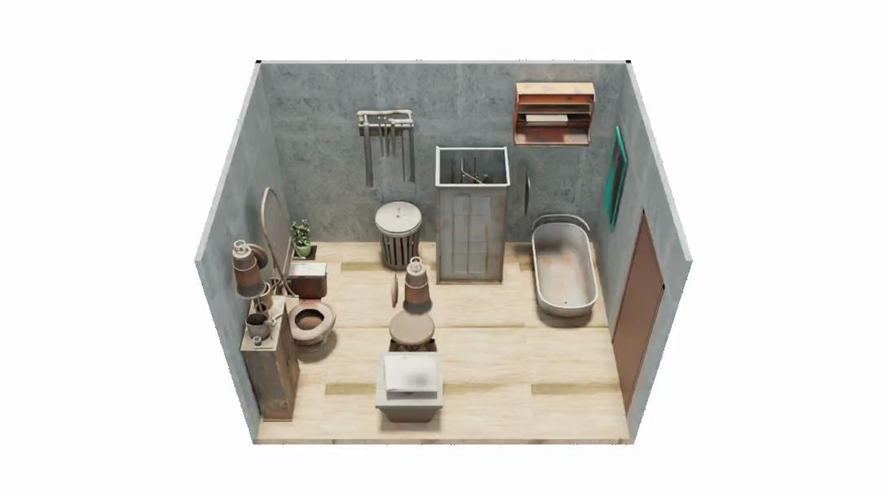

智能体驱动场景生成

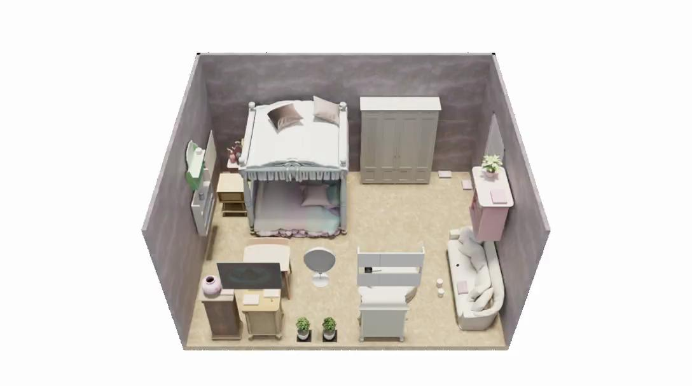

三 场景规模化 个 阶 动作生成与策略学习 段 Rusty and dusty restroom Gym Fairy-tale princess room ：

bedroom

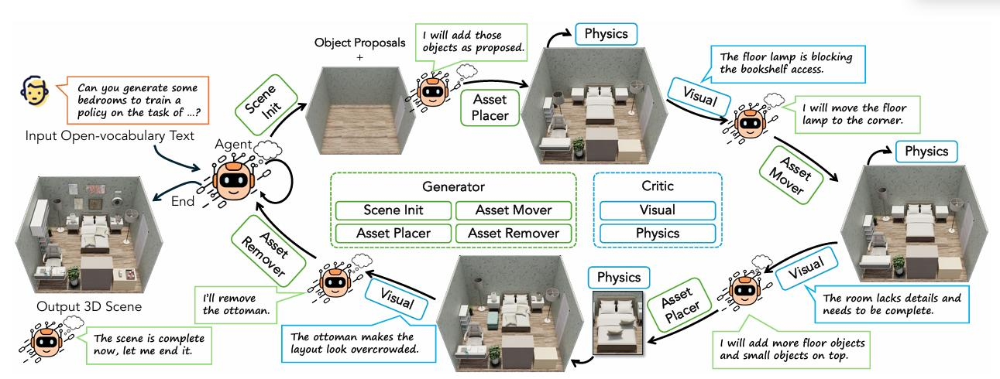

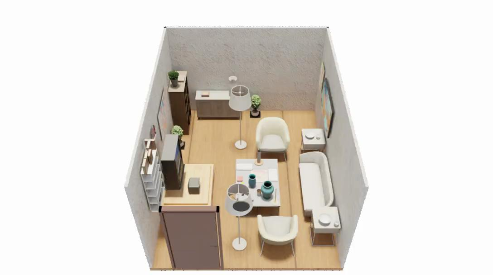

livingroom

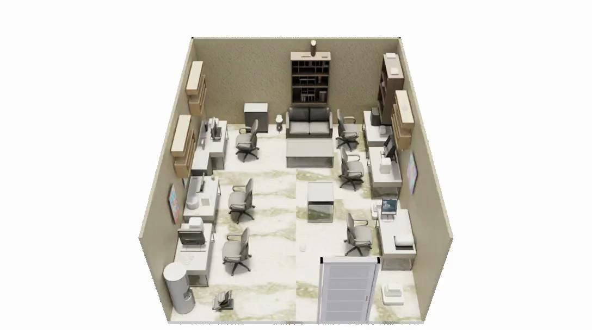

Office

<!-- Page 18 -->

https://threedle.github.io/ll3m/#

### 3D模型生成——LL3M

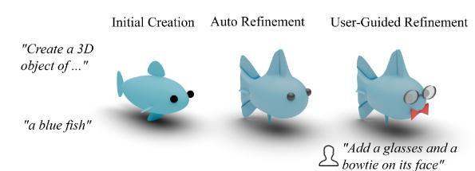

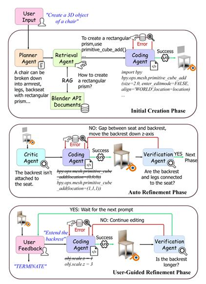

LL3M：多智能体系统，利用预训练大语 **1.**初始创建阶段 言模型通过编写可解释、模块化的 Blender Python代码，从文本描述生成和 规划智能体：将用户提示分 编辑3D资产，将3D建模重构为代码编写 解为子任务 任务。其中，代码是可解释、可编辑、模 检索智能体：查询 块化的，用户可通过修改代码参数或自然 BlenderRAG获取文档与示例 语言指令进行迭代式共创。

编码智能体：

不是传统扩散式text-to-3D，而是多 编写并执行Blender代码 agent协作完成plan / retrieve / write / debug / refine。

2. 自动优化阶段

评论智能体：多视角渲染

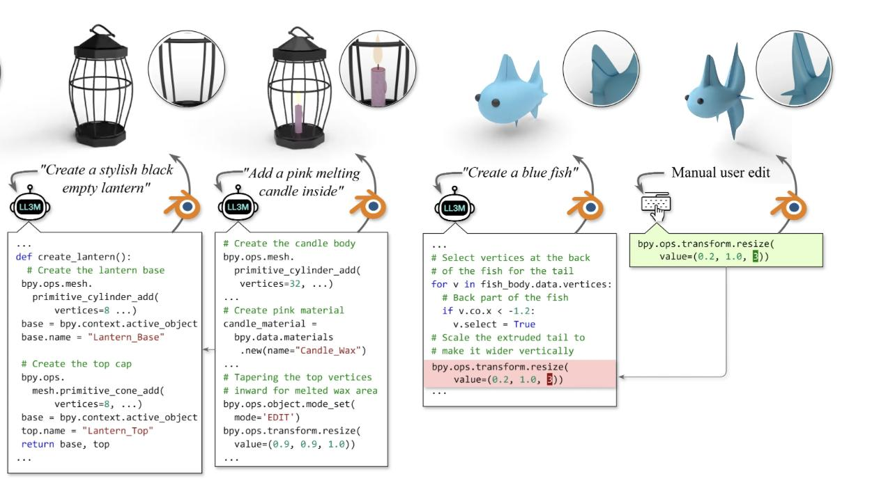

+VLM评估视觉问题,提出修 复建议 验证智能体：检查编码智能 体是否正确实现修复

3. 用户引导阶段

用户代理接收自然语言编辑 指令，触发编码智能体对现 有代码进行局部修改

<!-- Page 19 -->

### 参考资料

|名称|网址|描述|
|---|---|---|
|SAGE-10k|https://huggingface.co/datasets /nvidia/SAGE-10k|SAGE 论文配套的数据集，给 embodied AI 提供 simulation-ready 的 agentic 3D scenes。包含10,000 scenes、50 种 room types/styles、565K unique 3D objects。|
|Eval3DAIGC- 198|https://huggingface.co/yisuanw ang/Idea23D|专用评测集，包含 198 个 multimodal IDEA 输入，用于评估生成出的 3D 内容与输入想法的一致性。|
|ScanNet / ScanNet++|https://scannetpp.mlsg.cit.tum. de/scannetpp/|ScanNet 是一个 RGB-D 视频数据集，包含超过 1500 个扫描的 250 万个视角，数据集中提供了 3D 相机姿势、 表面重建和实例级语义分割标注。|
|DeepCAD|https://github.com/rundiwu/Dee pCAD|DeepCAD 是一个 CAD 数据集，由 179,133 个模型及其 CAD 构造序列组成。可用来训练 3D 形状的生成模型。|

1. 

Xia, Hongchi, et al. "Sage: Scalable agentic 3d scene generation for embodied ai." arXiv preprint arXiv:2602.10116 (2026).

2. 

Lu, Sining, et al. "Ll3m: Large language 3d modelers." arXiv preprint arXiv:2508.08228 (2025).

3. 

Mallis, Dimitrios, et al. "CAD-assistant: tool-augmented vllms as generic cad task solvers." Proceedings of the IEEE/CVF International Conference on Computer Vision. 2025.

4. 

Liu, Xinhang, Chi-Keung Tang, and Yu-Wing Tai. "Worldcraft: Photo-realistic 3d world creation and customization via llm agents." arXiv preprint arXiv:2502.15601 (2025).

5. 

Chen, Junhao, et al. "Idea23d: Collaborative lmm agents enable 3d model generation from interleaved multimodal inputs." Proceedings of the 31st International Conference on Computational Linguistics. 2025.

6. 

Wen, Beichen, et al. "3d scene generation: A survey." arXiv preprint arXiv:2505.05474 (2025).

7. 

Liu, Jian, et al. "A comprehensive survey on 3d content generation." arXiv preprint arXiv:2402.01166 (2024).

<!-- Page 20 -->

## 03 视频生成

20

<!-- Page 21 -->

### 角色视频生成智能体——AniMaker

AniMaker 是一个多智能体框架，旨在高效地从文本输入生成连贯的长篇叙事动画。与传统生成僵硬且支离破碎的剪 辑方法不同，AniMaker 支持多候选人生成、智能剪辑选择以及全局故事层面的一致性。

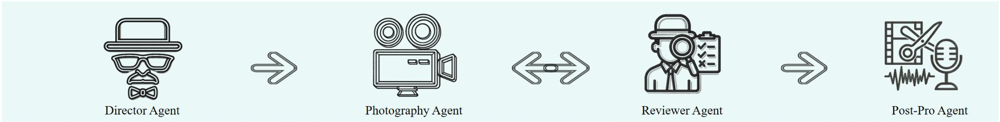

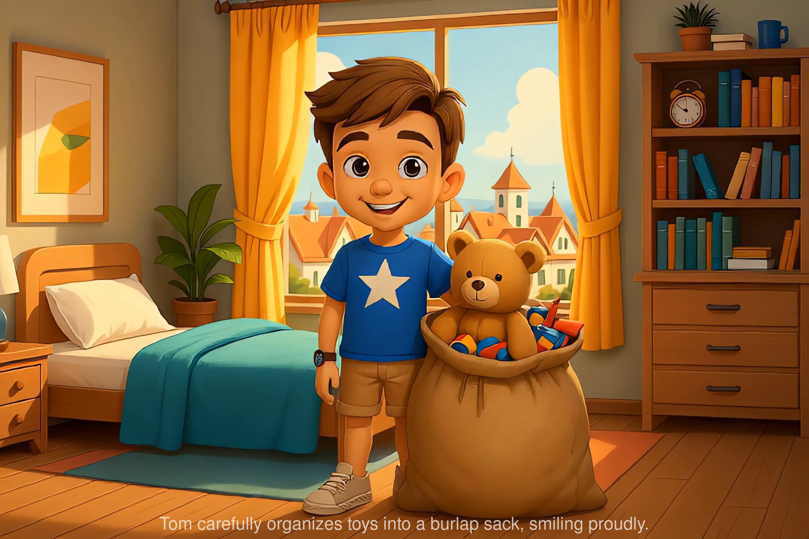

Once upon a time, in a small town, there was a square. In the square, there was a big sack. The sack was full of toys. It belonged to Tom, an honest boy. Tom loved to share his toys with other kids.

One sunny day, Tom went to the square with his sack. He saw a little girl named Lily. Lily was sad because she had no toys to play with. Tom wanted to help her.

Tom said, "Lily, do you want to play with my toys? I have a big sack of them." Lily looked at Tom and smiled. "Yes, please!" she said. Tom opened the sack and they played together all day.

Tom and Lily had so much fun playing with the toys. They shared and laughed together. All the other kids in the square saw how happy they were.

From that day on, Tom always brought his big sack of toys to the square.

He shared them with all the kids, and they all had fun together. Tom was an honest and kind boy, and everyone loved him.

https://animaker-dev.github.io/

<!-- Page 22 -->

### 角色视频生成智能体 ——AniMaker

后期制作Agent 摄影Agent：借鉴电影制作中的“No Good” 审稿Agent：提出AniEval，多镜头 （Gemini 2.0 （NG）流程，即为达到完美镜头需录制多次镜头。

动画评估框架，用于评估故事层面 Flash 提出了MCTS-Gen，受蒙特卡洛树搜索（MCTS） 的一致性、动作完成度以及片段间 +CosyVoice2 启发，高效生成多个候选片段并选择高潜力片段。

的动画特性。

+MoviePy）：

通过三个阶段将 视频片段转化为

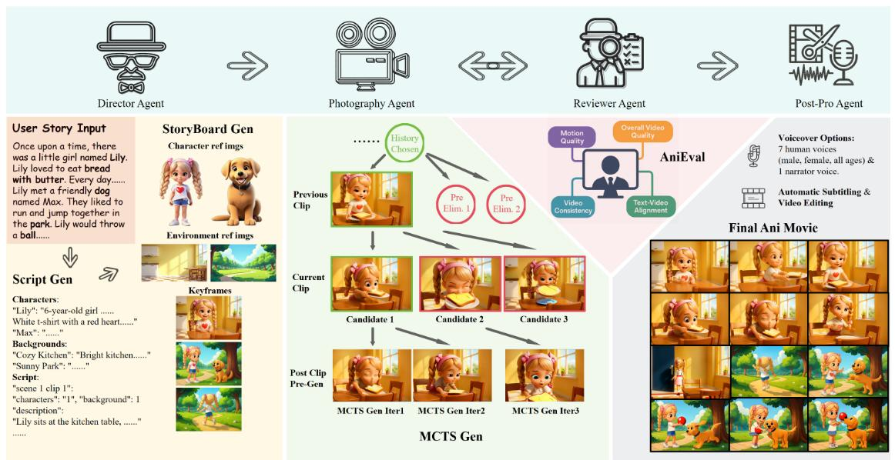

精致的动画影片。

导演Agent 首先生成详细的 （Gemini 2.0 配音脚本，指定 Flash 叙述、对话、情 +Hunyuan3D+ 感基调和期望的 FLUX1-dev 语音音色，并评 +GPT-4o）：

估文本长度以实 从输入文本生成 现视听同步。随 分镜，定义多场 后生成音频轨道。

景和多角色叙事 最后组装并确保 画面、配音和字 幕之间的精确同 步。

<!-- Page 23 -->

### 角色视频生成智能体 ——AniMaker

Prompt参考

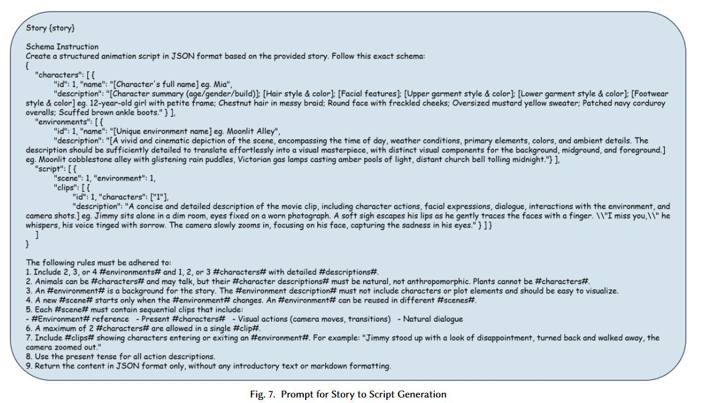

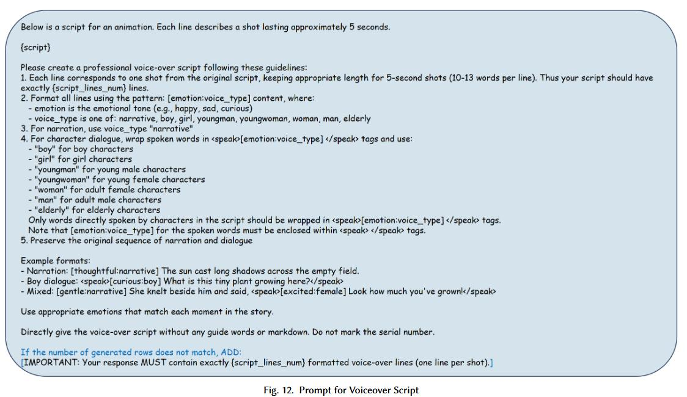

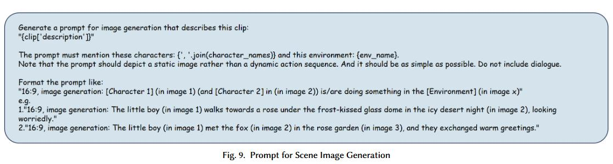

<!-- Page 24 -->

### 分镜视频生成智能体——Mora

Mora ：基于多智能体协作的开源视频生成框架，目标是用模 Video-to-video 块化方案复现并对标闭源模型 Sora 的能力，通过智能体分工、 editing: Change 自调制微调、无数据训练与人在环路筛选，实现高质量、多任 the setting to the 务的视频生成。

1920s with an old

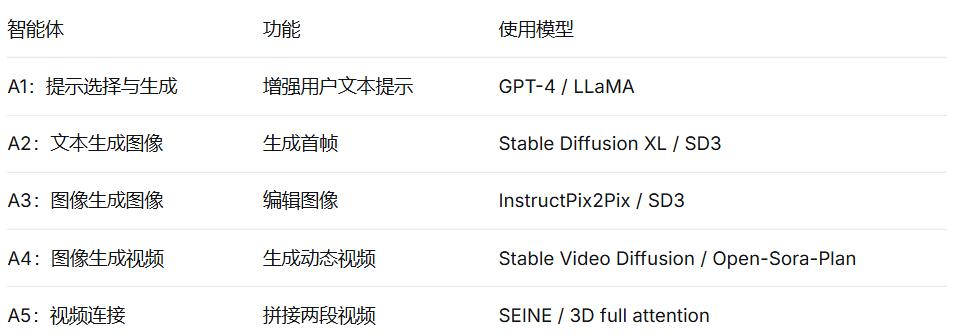

school car. make

sure to keep the red color.

Text-to-video generation: A majestic mountain range covered in snow, with the peaks

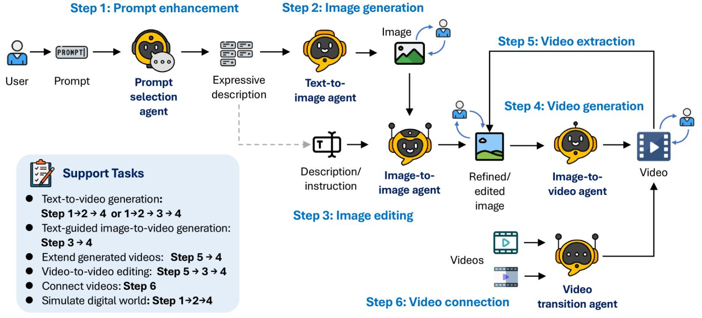

touching the clouds and a crystal-clear lake at its base,

reflecting the mountains and the sky, creating a breathtaking natural mirror.

https://github.com/lichao-sun/Mora

<!-- Page 25 -->

### 演示视频生成智能体——PresentAgent

文档解析 **PresentAgent**：多模态智能体框架，将长篇文档（如论文、网页、 幻灯片生成 报告）自动转化为带解说、幻灯片结构的演示视频，接近人类制 旁白生成 作水平。完成了视觉+语音+时间轴三者的同步对齐。

音视频合成

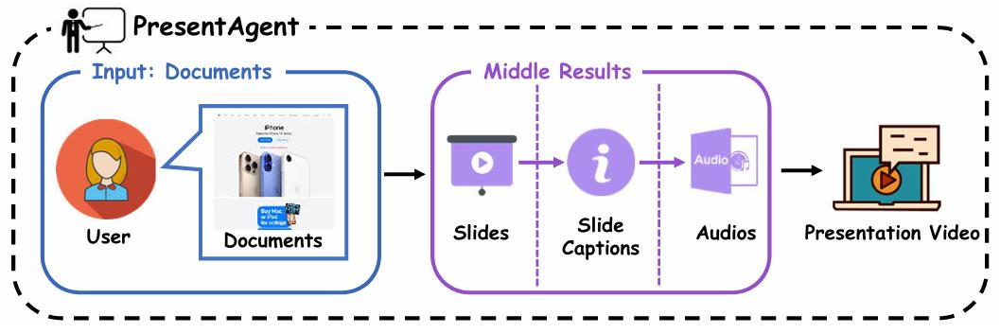

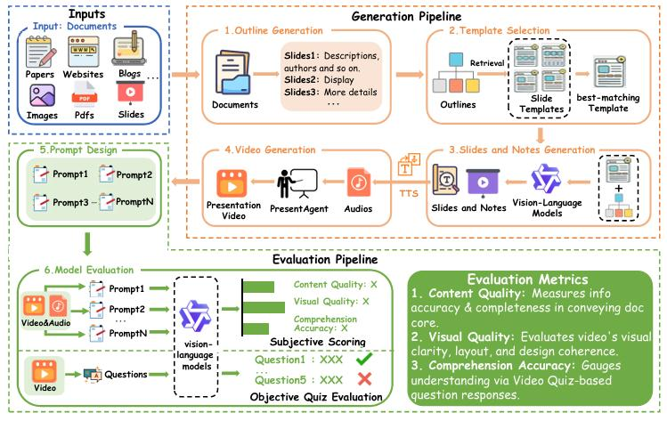

Demo：

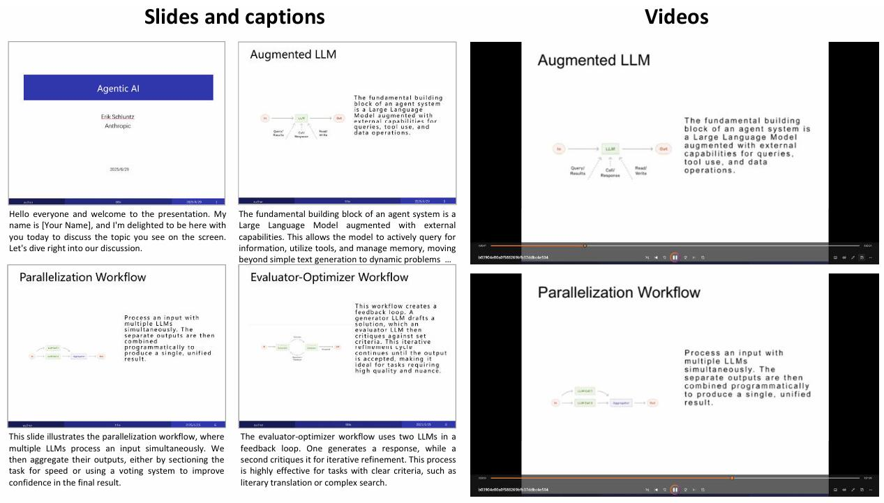

https://github.com/AIGeeksGroup/PresentAgent

<!-- Page 26 -->

### 参考资料

|名称|网址|描述|
|---|---|---|
|Doc2Present|https://huggingface.co/datasets /AIGeeksGroup/Doc2Present|多领域、多文体的真实对照数据集，其中每对数据都包含一个文档与一个配套的演示视频。数据包括：商业报告、 产品手册、政策简报、教程类文档等。|
|VidGen-1M|https://huggingface.co/datasets /Fudan-FUXI/VIDGEN-1M|文本转视频模型训练数据集。该数据集通过从粗到细的策划策略生成，保证高质量视频和详细的字幕 时间一致性 极佳。|
|Panda-70M|https://github.com/snap- research/Panda-70M|7000 万对高质量视频字幕对。|
|MiraData|https://github.com/mira- space/Miradata|具有长时长和结构化字幕的大规模视频数据集|
|MMTrail|https://github.com/litwellchi/M MTrail|包含超过2000万段预告片，具备高质量多模态字幕，整合上下文、视觉帧和背景音乐|

1. 

Yuan, Zhengqing, et al. "Mora: Enabling generalist video generation via a multi-agent framework." arXiv preprint arXiv:2403.13248 (2024).

2. 

Shi, Jingwei, et al. "Presentagent: Multimodal agent for presentation video generation." Proceedings of the 2025 Conference on Empirical Methods in Natural Language Processing: System Demonstrations. 2025.

3. 

Shi, Haoyuan, et al. "AniMaker: Multi-Agent Animated Storytelling with MCTS-Driven Clip Generation." Proceedings of the SIGGRAPH Asia 2025 Conference Papers. 2025.

4. 

Huang, Kaiyi, et al. "Genmac: compositional text-to-video generation with multi-agent collaboration." Proceedings of the AAAI Conference on Artificial Intelligence. Vol. 40. No. 7. 2026.

5. 

He, Liu, et al. "Kubrick: Multimodal agent collaborations for synthetic video generation." arXiv preprint arXiv:2408.10453 (2024).

6. 

Mu, Lingzhou, et al. "FantasyHSI: Video-Generation-Centric 4D Human Synthesis in Any Scene Through a Graph-Based Multi-Agent Framework." Proceedings of the AAAI Conference on Artificial Intelligence. Vol. 40. No. 10. 2026.

7. 

Wu, Kuizong, et al. "AutoMV: An Autonomous Agent Framework for Real Estate Marketing Video Generation." Proceedings of the AAAI Conference on Artificial Intelligence. Vol. 39. No. 28. 2025.

8. 

Soni, Achint, et al. "Videoagent: Self-improving video generation for embodied planning." NeurIPS 2025 Workshop on Bridging Language, Agent, and World Models for Reasoning and Planning. 2025.

<!-- Page 27 -->

### 给分标准

- 内容：

扩展部分为开放式，由同学自选Agent+图形学相关课题完成，包括但不限于2D生成、视频生成、3D生成等。

- 基础要求：
- 任意Agent+图形学相关课题。
- 提交报告PDF，含代码链接。
- 提交汇报PPT，按时进行汇报。
- 进阶要求：
- 发挥想象力，展示创新，包括但不限于新应用、新方法。
- 具体实现不做限制，实现方式不影响给分，推荐使用免费资源（详见下页）。
- 推荐参考他人论文、博客与开源代码，但需要给出明确的引用。
- 给分标准：
- 基础给分：10分，准时提交报告PDF和汇报PPT，按时汇报即可。
- 质量给分：10分，根据报告创新性和汇报展示综合给分。
- 如果包含原创性的、有效的创新，可获得整个PJ3满分（20分）。

<!-- Page 28 -->

### 语言模型参考

1. 国外免费API：

NVIDIA（免费API）：https://build.nvidia.com/explore/discover Google AI Studio（免费API）：https://aistudio.google.com OpenRouter（免费API）：https://openrouter.ai/docs/api-reference/limits Opencode（免费API）：https://opencode.ai/zen

2. 国内免费API：

GLM（免费API）：https://open.bigmodel.cn/ 硅基流动（免费API）：https://siliconflow.cn/ Minimax（免费额度）：https://platform.minimaxi.com/ KIMI（免费额度）：https://platform.kimi.com/

3. 本地部署：

Ollama: https://ollama.com/ LMStudio: https://lmstudio.ai/

- 以上内容仅供参考，具体实现不做限制，实现方式不影响给分。

<!-- Page 29 -->

### Agent框架参考

1. 开源Agent框架：

DeepAgent: https://github.com/langchain-ai/deepagents OpenClaw: https://github.com/openclaw/openclaw Hermes Agent: https://github.com/NousResearch/hermes-agent Claude Code: https://github.com/anthropics/claude-code Codex: https://github.com/openai/codex Gemini Cli: https://github.com/google-gemini/gemini-cli

2. 开源图形学软件：

ComfyUI: https://www.comfy.org/zh-cn/ Blender: https://docs.blender.org/api/current/index.html FreeCAD: https://wiki.freecad.org/Python_scripting_tutorial/zh-cn

- 以上内容仅供参考，具体实现不做限制，实现方式不影响给分。

<!-- Page 30 -->

### 报告要求

- 要求：使用英文，描述清晰，提交PDF文件。
- 格式：长度格式不做限制，推荐使用latex，参考ICLR会议模板。

（https://github.com/ICLR/Master-Template/）

- 内容：

摘要 介绍 相关工作 方法 实验结果 结论 注意：

- 

如果使用公开代码和数据需要引用。

请在摘要附上代码链接。

请在结尾给出具体组员的姓名、学号与分工情况。

<!-- Page 31 -->

### 汇报要求

- 制作汇报PPT，讲解如下内容：

选题的内容 方法创新性 结果展示 人员分工

- 时间：6月11日（15周） 6月18日（16周）
- 内容：展示内容可以是图片、视频、网站、软件等，不做限制。
- 时长：每组时间控制在10分钟左右。
- 压缩包标题：2026图形学Project3  姓名1 姓名2 姓名3 姓名4 （最多4人）
- 提交到elearning：报告PDF+汇报PPT打包成zip，DDL：6月10日晚23：59
